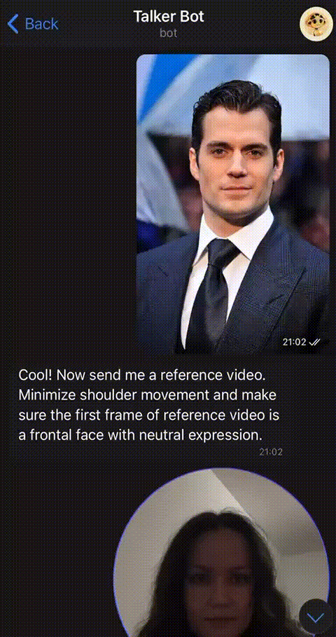

# 🎭 Talker Bot

This is a Telegram bot that allows users to generate animated face videos using a reference image and a driving video.

## Key Features ✨

- Animates photo based on the movement and speach in the driving video
- Users can keep original driving video's voice or set different voice for the animations 
- Multi-Language Support: Allows users to interact with the bot in their preferred language (currently supports English, German and Russian).
- Allowlist System: Only allows access to the bot for users authorized by admin.

⚠️ Note: The facial animation technology is powered by [LivePortrait](https://github.com/KwaiVGI/LivePortrait). Voice conversion technology is  powered by [TTS](https://github.com/coqui-ai/TTS). This bot only wraps that functionality into a user-friendly Telegram interface.

---

## How It Works 🛠



- [optional] Users call `/set_voice` command to set a certain voice for animations (original, male, female or custom)
- Users upload a photo (`.jpg`, `.png`, etc.)
- Bot asks for a driving video
- Users upload a video (`.mp4` or a round video note)
- Bot sends the resulting animation back to the user

---

## Getting Started 🚀

1. Clone the repository.

2. Clone & Set Up [LivePortrait](https://github.com/KwaiVGI/LivePortrait) into `./LivePortrait`. Follow the official setup guide from LivePortrait — including Python environment, dependencies, and downloading the required model checkpoints. Ensure that the inference script and models are working correctly before continuing.

3. Add Bot-Specific Dependencies
   ```bash
   pip install -r requirements.txt
   ```

4. Configure the Bot:

* Create your own Telegram bot using @BotFather.
* Add `.env` file with Telegram bot token **TG_BOT_TOKEN** and Telegram username of admin **ADMIN_NICKNAME**.
* Update the `config.py` file with your preferred settings. Modify the `supported_languages` list to include the languages you want to support and add the corresponding translations in `resources/bot_messages.json`.
* Add authorized users to the allowlist.

5. Run the bot:
   ```bash
   python main.py
   ```

---

## Bot Commands 🗨️

| Command                | Description                                |
|----------------        |--------------------------------------      |
| `/start`               | Starts a new conversation                  |
| `/set_lang`            | Set a conversation language                |
| `/set_voice`           | Set a default voice for animations         |
| `/upload_voice`        | Upload a custom voice for animations       |
| `/cancel`              | Cancel current operation                   |
| `/add_admin <username>`| Add an admin user (admin-only)             |
| `/add_user <username>` | Add a regular user (admin-only)            |
| `/del_user <username>` | Remove a user (admin-only)                 |
| `/show_users`          | List all users and their roles (admin-only)|

---

## Notes 📌 

- The bot performs image cropping to center the face and resize to a standard resolution.
- Driving video duration is limited to avoid processing delays.
- Animated videos are sent as video notes by default.

---

Enjoy using **TalkerBot**!

For any questions or issues, please open an issue on GitHub or contact me by email olgatrofimova96@gmail.com.